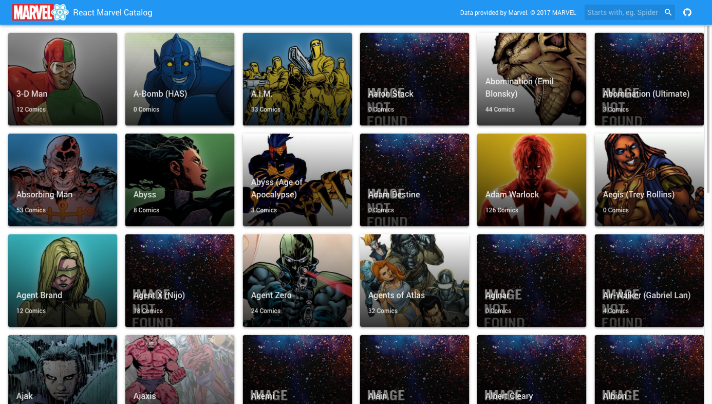
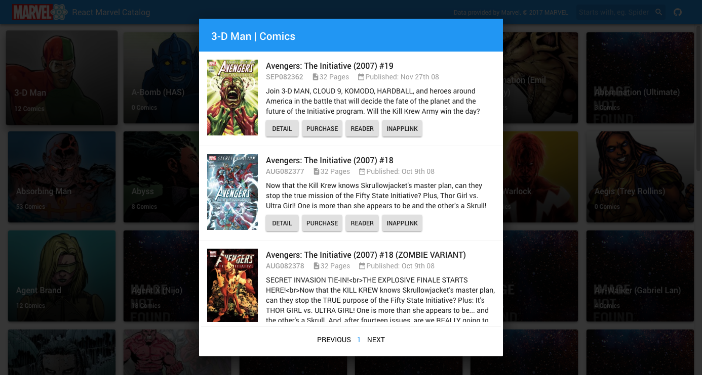

# React Marvel Catalog


This is a sample React app that demonstrates how to use the marvel API with redux and sagas to show a list of marvel characters and a list of comic books for each character.

#### ❗ Important ❗
How Marvel limit our request to **3000 requests** a day, maybe the demo page will not work depend how much users are trying to run, if you can run this demo, install this project in your machine and use [your own API keys](https://developer.marvel.com/documentation/getting_started) from marvel

`./src/config/config.js`
```
export const marvelApi = {
  publicKey: 'YOUR_PUBLIC_KEY',
  privateKey: 'YOUR_PRIVATE_KEY',
  baseUrl: `${window.location.protocol || 'http'}//gateway.marvel.com:80`,
}
```

## Libs
 - [Redux](http://redux.js.org/)
 - [Moment](https://momentjs.com/)
 - [ReduxSaga](https://github.com/redux-saga/redux-saga)
 - [Material UI](https://material-ui-1dab0.firebaseapp.com)
---
## Screenshot




## What it does?
This sample must provide the follow functionalities:
 - A list of cards of characters loaded from the marvel API
 - Each card open a dialog with a collection of comic books
 - Infinite scroll integrated with API pagination

## Possible implementations
 - List of events
 - More details for each comic book
 - Any ideas?

 ---


 # Get started

 ```
 $ git clone https://github.com/thiagoterleski/react-marvel-catalog
 $ cd react-marvel-catalog
 $ yarn install
 $ yarn start
 ```

 This sample was made with *Create React App* [(more information)](https://github.com/facebookincubator/create-react-app/issues/new) see the doc for requirements.
